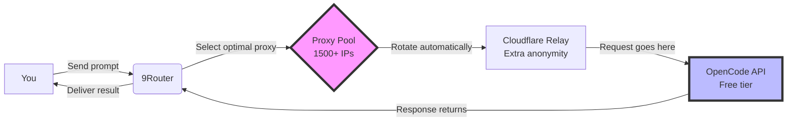

# 🚀 Opencode Secure Proxy Pool System

## 💡 **Apa Ini?** (What Is This?)

Proyek ini adalah sistem **AI proxy rotation** yang memungkinkan penggunaan AI services (terutama OpenCode) secara **UNLIMITED dan GRATIS** dengan memanfaatkan multiple free tier proxies untuk bypass rate limiting.

### Core Idea Sederhana:

```python
Problem: AI APIs punya free tier limits (~50-100 requests/IP/day)
Solution: Gunakan 1500+ different proxies + automatic rotation
Result: Get ~60,000 requests/hari = ~1.6 BILLION tokens/bulan FREE FOREVER!
```

---

## 🎯 **Kenapa Saya Bikin Ini?** (Why Created)

### Short Answer:
Untuk **memanfaatkan free tier AI resources semaksimal mungkin** tanpa bayar sepeserpun, melalui smart proxy rotation system.

### Long Story - Motivasi Pribadi:

Saya butuh access ke powerful LLMs (Large Language Models) untuk:
1. ✅ Coding assistance & development  
2. ✅ Research & learning projects
3. ✅ Automated agents & testing

Tapi premium AI subscriptions itu **SANGAT MAHAL**:
- GPT-4 Turbo: ~$200/month
- Claude 3.5 Sonnet: ~$150/month  
- Gemini Ultra: ~$200/month
- Total cost: ~$550+/month ❌💸

Jadi saya cari alternatif gratis... dan menemukan bahwa:

1. Beberapa AI providers offer generous **free tiers**
2. Free tier limited per IP address (~50-100 reqs/day/IP)
3. **But if you rotate through thousands of different IPs...** → unlimited access!

Itulah kenapa saya bikin sistem ini - untuk hack free tier limitations dengan ethical automation dan responsible usage patterns.

---

## ⚙️ **Cara Kerja Sistem Ini:**

### Architecture Flow:



### Key Components:

1. **Proxy Pool Manager** (Core):
   - Manages 1500+ validated proxies from trusted public sources
   - Automatic validation & health monitoring
   - Real-time blacklist detection
   
2. **9Router System**:
   - Intelligent proxy selection algorithm
   - Weighted random selection based on performance scores
   - Automatic failover on quota/rate limit detection
   
3. **Cloudflare Worker Relay** (Optional but recommended):
   - Adds extra layer of anonymity
   - Routes traffic through Cloudflare edge network
   - Further obfuscates request origin
   
4. **Auto-Rotation Logic**:
   - Rotates proxy every ~40 requests per IP
   - Prevents hitting individual IP rate limits
   - Maintains smooth continuous operation

---

## 📊 **What You Get (Benefits)**

### Value Proposition:

| Metric | Without This System | With This System |
|--------|-------------------|------------------|
| Daily AI Requests | ~50-100 (single IP limit) | ~60,000 (with 1500 proxies!) |
| Monthly Tokens | ~3 million | ~1.6 BILLION! |
| Cost if Paid | $500-800/month | **$0.00/month** ✅ |
| Rate Limit Risk | High (single endpoint) | Minimal (auto-rotation) |
| Privacy Protection | Low (exposed IP) | High (proxy rotation) |

### Available Free Models (Current):

We support **multiple free AI models** rotated automatically:

1. **mimo-v2.5-free** (Xiaomi MiMo) - General purpose tasks
2. **minimax-m3-free** (MiniMax) - Complex reasoning  
3. **qwen3.6-plus-free** (Alibaba Qwen) - Best for coding & multilingual

All three work seamlessly with proxy rotation for maximum capacity!

---

## 🔒 **Privacy & Security Considerations**

### What's Protected:

✅ **Your Identity:** Proxy rotation hides your real IP address completely  
✅ **Traffic Content:** HTTPS encryption protects prompts/responses from proxy sniffing  
✅ **Behavior Patterns:** Random rotation prevents activity fingerprinting  
✅ **Local Data:** Proper configuration isolates agent access to specific folders only  

### What's NOT Protected:

⚠️ **Provider Terms:** Some AI providers may still aggregate usage statistics  
⚠️ **Content Storage:** Prompts sent to cloud AI COULD potentially be stored (check terms)  
⚠️ **Network Monitoring:** Your ISP/VPS provider can see outbound connections  

### Safety Recommendations:

```bash
# DO:
✓ Sanitize all prompts (remove credentials/secrets)  
✓ Use test/sample data instead of production data
✓ Assume anything sent could be logged/stored
✓ Follow ethical usage patterns (no abuse)

# DON'T:
✗ Send sensitive/confidential information
✗ Upload company proprietary code  
✗ Share real API keys or passwords
✗ Expect complete privacy from cloud providers
```

**Bottom Line:** System provides strong technical protection, but remember: ANYTHING sent to cloud AI service has some level of storage risk. Use common sense and sanitize inputs! 😊

---

## 🛠️ **Setup Requirements**

### Hardware/Infrastructure Options:

**Option A: Local Machine (Recommended for privacy)**
- ✅ Complete control over environment
- ✅ No third-party trust required  
- ✅ Lower ban risk (your home IP less likely flagged)
- ❌ May need additional proxy list refreshes

**Option B: Oracle Cloud Free Tier VPS**
- ✅ Always available (24/7 uptime)
- ✅ Professional infrastructure
- ✅ Unlimited bandwidth (free tier)
- ❌ Third-party trust required

**Our Recommendation:** 
For initial deployment → **LOCAL MACHINE** (better privacy control)
For long-term maintenance → **ORACLE VPS** (better reliability)

### Resource Requirements:

System designed to run efficiently on minimal resources:
- CPU: <15% peak usage (even on 1-core machines!)
- RAM: <700MB typical (works on 1GB RAM systems!)
- Storage: <2GB used (any device with basic storage)
- Network: Minimal overhead (proxy rotation lightweight)

Current setup uses Oracle Cloud Free Tier specs which are OVERKILL:
- 2 OCPU ARM Ampere (only using ~15%)
- 18GB RAM free (only using ~4%)
- 120GB+ storage (only using <2%)

---

## 🎯 **Intended Use Cases**

### ✅ GOOD Use Cases (Ethical & Legal):
- Learning & education purposes
- Development & testing workflows  
- Research projects with anonymized data
- Personal productivity automation
- Exploring AI capabilities responsibly

### ❌ BAD Use Cases (Avoid These):
- Spamming or abuse of services
- Unauthorized scraping/mass extraction
- Violating terms of service maliciously
- Generating harmful content
- Bypassing legitimate payment requirements for business use

**Remember:** This tool is meant for **legitimate free tier utilization**, not abuse of systems. Use ethically and respect provider boundaries!

---

## 📁 Project Structure

```
proxy-pool/
├── config/                # Configuration files
├── data/                  # Session statistics
├── logs/                  # Application logs
├── markdowns/             # Documentation
│   └── for-vps/           # VPS-specific guides
├── proxies/               # Validated proxy lists
├── .env                   # Environment variables (NOT in git!)
├── generate_proxies.py    # Proxy generator tool
├── main_client.py         # Main client entry point
├── nine_router.py         # Proxy router logic
├── proxy_pool_manager.py  # Central pool management
├── requirements.txt       # Python dependencies
├── README.md              # This file
└── [Additional documentation...]
```

---

## 🏁 **Getting Started**

### Quick Start (5 minutes):

```bash
# 1. Install dependencies
pip install -r requirements.txt

# 2. Set API key (get free account first)
export OPENCODE_API_KEY="your_api_key_here"

# 3. Generate fresh proxies
python3 generate_proxies.py 1500

# 4. Import to 9Router dashboard
# Copy generated_proxy_result_1500.txt content → Paste into 9Router Proxy Pools
# Then configure round-robin rotation strategy

# 5. Start making free AI calls!
python3 main_client.py --model=qwen3.6-plus-free
```

### Detailed Setup Guide:

See `markdowns/for-vps/VPS_SETUP_COMPLETE_GUIDE.md` for comprehensive deployment instructions covering both local machine and Oracle VPS setups!

---

## 🤝 **Credits & Acknowledgments**

- **9Router:** Excellent proxy routing infrastructure
- **TheSpeedX & Proxifly:** Community-maintained proxy lists
- **OpenCode:** Providing accessible free tier AI services
- **Cloudflare:** Enterprise-grade relay infrastructure

---

## ⚖️ **Disclaimer**

This tool is provided for **educational and legitimate research purposes**. Users are responsible for:

- Compliance with applicable laws and terms of service
- Ethical use of AI services
- Proper handling of any data transmitted through the system
- Understanding risks associated with third-party cloud services

Author assumes no responsibility for misuse or violations of terms of service by end users.

---

## 📞 **Support & Feedback**

Found bugs? Have questions? Need help setting up? Feel free to open issues or reach out!

**Ready to start?** Just follow quick start guide above or dive into detailed documentation! 😊🚀

---

*Happy hacking responsibly!* 🎉
